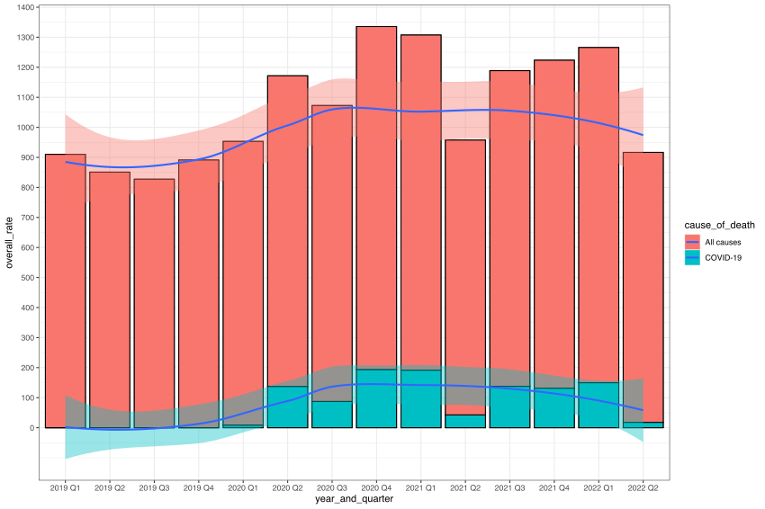

# Analysis US quartely covid data from CDC

## Identify the goal

We want to get to know the overall death data and COVID realted death data since 2019, so that we can analysis the impact of COVID to the overall pupular death in US in these years.

## Download the data

We will use NCHS(National Center for Health Statistics) as our data source.
Visit https://data.cdc.gov/browse?category=NCHS&sortBy=last_modified, and search `VSRR Quarterly`, we will find the data we are intrest.

https://data.cdc.gov/NCHS/NCHS-VSRR-Quarterly-provisional-estimates-for-sele/489q-934x, in this page, we can export data into csv file.

With that, we may get the data source csv, `NCHS_-_VSRR_Quarterly_provisional_estimates_for_selected_indicators_of_mortality.csv`

## Take a quick look for the data

TO load the data
```
# If "readr" not installed, run install.packages("readr") to install it
library("readr")
df <- readr::read_csv(file.path(getwd(), "NCHS_-_VSRR_Quarterly_provisional_estimates_for_selected_indicators_of_mortality.csv"), col_names = TRUE)

```

To check the first fiew lines

```
> head(df)
# A tibble: 6 × 69
  Year a…¹ Time …² Cause…³ Rate …⁴ Unit  Overa…⁵ Rate …⁶ Rate …⁷ Rate …⁸ Rate …⁹
  <chr>    <chr>   <chr>   <chr>   <chr>   <dbl>   <dbl>   <dbl>   <dbl>   <dbl>
1 2019 Q1  12 mon… All ca… Age-ad… Deat…   712.    600.    844.       NA      NA
2 2019 Q1  12 mon… Alzhei… Age-ad… Deat…    29.6    33.1    23.8      NA      NA
3 2019 Q1  12 mon… COVID-… Age-ad… Deat…    NA      NA      NA        NA      NA
4 2019 Q1  12 mon… Cancer  Age-ad… Deat…   148.    128.    175.       NA      NA
5 2019 Q1  12 mon… Chroni… Age-ad… Deat…    11       7.7    14.7      NA      NA
6 2019 Q1  12 mon… Chroni… Age-ad… Deat…    38.5    35.7    42.4      NA      NA
# … with 59 more variables: `Rate Age 15-24` <dbl>, `Rate Age 25-34` <dbl>,
#   `Rate Age 35-44` <dbl>, `Rate Age 45-54` <dbl>, `Rate Age 55-64` <dbl>,
#   `Rate 65-74` <dbl>, `Rate Age 75-84` <dbl>, `Rate Age 85 plus` <dbl>,
#   `Rate Alaska` <dbl>, `Rate Alabama` <dbl>, `Rate Arkansas` <dbl>,
#   `Rate Arizona` <dbl>, `Rate California` <dbl>, `Rate Colorado` <dbl>,
#   `Rate Connecticut` <dbl>, `Rate District of Columbia` <dbl>,
#   `Rate Delaware` <dbl>, `Rate Florida` <dbl>, `Rate Georgia` <dbl>, …
# ℹ Use `colnames()` to see all variable names

```

To get summary
```
summary(df)
 Year and Quarter   Time Period        Cause of Death      Rate Type        
 Length:1232        Length:1232        Length:1232        Length:1232       
 Class :character   Class :character   Class :character   Class :character  
 Mode  :character   Mode  :character   Mode  :character   Mode  :character  

     Unit            Overall Rate     Rate Sex Female   Rate Sex Male    
 Length:1232        Min.   :   1.20   Min.   :   0.60   Min.   :   1.90  
 Class :character   1st Qu.:  11.40   1st Qu.:   6.95   1st Qu.:  13.20  
 Mode  :character   Median :  17.00   Median :  14.80   Median :  23.50  
                    Mean   :  80.51   Mean   :  70.56   Mean   :  91.63  
                    3rd Qu.:  50.60   3rd Qu.:  49.92   3rd Qu.:  65.42  
                    Max.   :1142.30   Max.   :1067.00   Max.   :1219.90  
                    NA's   :44        NA's   :44        NA's   :44       
  ...
```

To get glimpse from columns point of view
```
> library("dplyr")
> glimpse(df)
Rows: 1,232
Columns: 69
$ `Year and Quarter`          <chr> "2019 Q1", "2019 Q1", "2019 Q1", "2019 Q1"…
$ `Time Period`               <chr> "12 months ending with quarter", "12 month…
$ `Cause of Death`            <chr> "All causes", "Alzheimer disease", "COVID-…
$ `Rate Type`                 <chr> "Age-adjusted", "Age-adjusted", "Age-adjus…
$ Unit                        <chr> "Deaths per 100,000", "Deaths per 100,000"…
$ `Overall Rate`              <dbl> 712.2, 29.6, NA, 148.1, 11.0, 38.5, 21.3, …
$ `Rate Sex Female`           <dbl> 600.3, 33.1, NA, 127.9, 7.7, 35.7, 16.8, 1…
$ `Rate Sex Male`             <dbl> 843.7, 23.8, NA, 175.4, 14.7, 42.4, 26.9, …
$ `Rate Age 1-4`              <dbl> NA, NA, NA, NA, NA, NA, NA, NA, NA, NA, NA…
$ `Rate Age 5-14`             <dbl> NA, NA, NA, NA, NA, NA, NA, NA, NA, NA, NA…
$ `Rate Age 15-24`            <dbl> NA, NA, NA, NA, NA, NA, NA, NA, NA, NA, NA…
$ `Rate Age 25-34`            <dbl> NA, NA, NA, NA, NA, NA, NA, NA, NA, NA, NA…
$ `Rate Age 35-44`            <dbl> NA, NA, NA, NA, NA, NA, NA, NA, NA, NA, NA…
$ `Rate Age 45-54`            <dbl> NA, NA, NA, NA, NA, NA, NA, NA, NA, NA, NA…
$ `Rate Age 55-64`            <dbl> NA, NA, NA, NA, NA, NA, NA, NA, NA, NA, NA…
$ `Rate 65-74`                <dbl> NA, NA, NA, NA, NA, NA, NA, NA, NA, NA, NA…
$ `Rate Age 75-84`            <dbl> NA, NA, NA, NA, NA, NA, NA, NA, NA, NA, NA…
...
```

## Clear the columns name

As we can see, the colnames is having space, it may cause some trouble while refering it in R, it's a common sugestion to convert space to "_" before doing any R o/p.

A good thing is , there is a good R package can help us to do it.

```
> library("janitor")
> df <- clean_names(df)
!> glimpse(df)
 Rows: 1,232
 Columns: 69
 $ year_and_quarter          <chr> "2019 Q1", "2019 Q1", "2019 Q1", "2019 Q1", …
 $ time_period               <chr> "12 months ending with quarter", "12 months …
 $ cause_of_death            <chr> "All causes", "Alzheimer disease", "COVID-19…
 $ rate_type                 <chr> "Age-adjusted", "Age-adjusted", "Age-adjuste…
 $ unit                      <chr> "Deaths per 100,000", "Deaths per 100,000", …
 $ overall_rate              <dbl> 712.2, 29.6, NA, 148.1, 11.0, 38.5, 21.3, 20…
 $ rate_sex_female           <dbl> 600.3, 33.1, NA, 127.9, 7.7, 35.7, 16.8, 13.…
 $ rate_sex_male             <dbl> 843.7, 23.8, NA, 175.4, 14.7, 42.4, 26.9, 27…
 $ rate_age_1_4              <dbl> NA, NA, NA, NA, NA, NA, NA, NA, NA, NA, NA, …
```

As you can see, while we run `glimpse(df)`, the colum name has been changed from "Year and Quarter" to "year_and_quarter".
## Filter and select

The raw data has so many columns and rows, but we just want to focus on those cols/rows we really have intrest.

We can use `filter`(applying on rows) and `select`(applying on columns) in such condition.

```
> df1 <- df %>%
      filter(time_period == "3-month period" & rate_type == "Crude" & cause_of_death %in% c("All causes", "COVID-19")) %>%
      select(year_and_quarter, cause_of_death, overall_rate)
> print(df1,n=50)
 # A tibble: 28 × 3
    year_and_quarter cause_of_death overall_rate
    <chr>            <chr>                 <dbl>
  1 2019 Q1          All causes            910
  2 2019 Q1          COVID-19               NA
  3 2019 Q2          All causes            851.
  4 2019 Q2          COVID-19               NA
  5 2019 Q3          All causes            827.
  6 2019 Q3          COVID-19               NA
  7 2019 Q4          All causes            891.
  8 2019 Q4          COVID-19               NA
  9 2020 Q1          All causes            945.
 10 2020 Q1          COVID-19                8.2
 11 2020 Q2          All causes           1035.
 12 2020 Q2          COVID-19              137.
 13 2020 Q3          All causes            985.
 14 2020 Q3          COVID-19               87.3
 15 2020 Q4          All causes           1142.
 16 2020 Q4          COVID-19              193.
 17 2021 Q1          All causes           1116
 18 2021 Q1          COVID-19              191.
 19 2021 Q2          All causes            915.
 20 2021 Q2          COVID-19               42.4
 21 2021 Q3          All causes           1051.
 22 2021 Q3          COVID-19              138.
 23 2021 Q4          All causes           1092.
 24 2021 Q4          COVID-19              131.
 25 2022 Q1          All causes           1116
 26 2022 Q1          COVID-19              150.
 27 2022 Q2          All causes            899.
 28 2022 Q2          COVID-19               17.6
```

`%>%` looks strange, it's just like `| (pipe)` in linux shell command.


```
df1 <- df %>%
    filter(time_period == "3-month period" & rate_type == "Crude" & cause_of_death %in% c("All causes", "COVID-19")) %>%
    select(year_and_quarter, cause_of_death, overall_rate)
```

it means only keep those rows which meet those condition of `filter`, and those columns which meet those condition of `select`
## Deal with NA value

As you can see, in "overall_rate" column, there are few "NA" values, in this context it means 0, so we may want to convert it as 0 for future's process.

We can do it like this.

```
 > df1 <- df1 %>%
     mutate_at(c("overall_rate"), ~coalesce(.,0))
```

it means , we want to convert all NA to 0 in "overall_rate" column
Now, let's check the df1 again, we can see all NA has been changed to 0.

```
!+ > df1
 # A tibble: 28 × 3
    year_and_quarter cause_of_death overall_rate
    <chr>            <chr>                 <dbl>
  1 2019 Q1          All causes            910
  2 2019 Q1          COVID-19                0
  3 2019 Q2          All causes            851.
  4 2019 Q2          COVID-19                0
  5 2019 Q3          All causes            827.
  6 2019 Q3          COVID-19                0
  7 2019 Q4          All causes            891.
  8 2019 Q4          COVID-19                0
  9 2020 Q1          All causes            945.
 10 2020 Q1          COVID-19                8.2
 # … with 18 more rows
```


## Draw diagram for the whole US's data

```
> ggplot(df1, aes(fill=cause_of_death, x=year_and_quarter, y=overall_rate)) +
    geom_bar(position="stack", stat="identity") +
    geom_col() +
    geom_smooth(aes(group=cause_of_death)) +
    scale_y_continuous(breaks=seq(0,1500,100))
    theme_bw()
```

It may open a diagram in your computer.
We also can save the diagram into a file.

```
library(sjPlot)
p = ggplot(df1, aes(fill=cause_of_death, x=year_and_quarter, y=overall_rate)) +
    geom_bar(position="stack", stat="identity") +
    geom_col() +
    geom_smooth(aes(group=cause_of_death)) +
    scale_y_continuous(breaks=seq(0,1500,100)) +
    theme_bw()

save_plot("covid_plot.svg", fig = p, width=30, height=20)
```

see the diagram 

## Draw diagram for  California data

Do you want to try it by yourself?

## Create/Calculate a new column for covid ratio

Somehow, we want to get to know the trend for covid ratio.
  - covid_ratio = overall_rate_of_covid / overall_rate_of_all_causes

```
covid_death_rate <- df1 %>%
    filter(cause_of_death == "COVID-19") %>%
    select("overall_rate")

all_causes_rate <- df1 %>%
    filter(cause_of_death == "All causes") %>%
    select(overall_rate)

covid_ratio <- covid_death_rate / all_causes_rate

df_ratio <- df1 %>%
    filter(cause_of_death == "All causes") %>%
    select(year_and_quarter)
df_ratio["covid_ratio"] = covid_ratio


> print(df_ratio)
# A tibble: 14 × 2
   year_and_quarter covid_ratio
   <chr>                  <dbl>
 1 2019 Q1              0      
 2 2019 Q2              0      
 3 2019 Q3              0      
 4 2019 Q4              0      
 5 2020 Q1              0.00868
 6 2020 Q2              0.132  
 7 2020 Q3              0.0886 
 8 2020 Q4              0.169  
 9 2021 Q1              0.171  
10 2021 Q2              0.0463 
11 2021 Q3              0.131  
12 2021 Q4              0.120  
13 2022 Q1              0.134  
14 2022 Q2              0.0196 
```
## Draw diagram for covid ratio


Do you want to try it by yourself?
