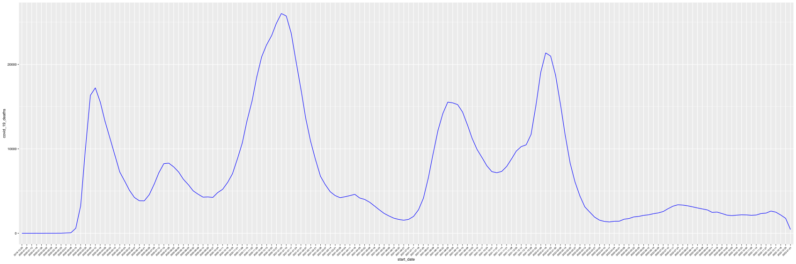
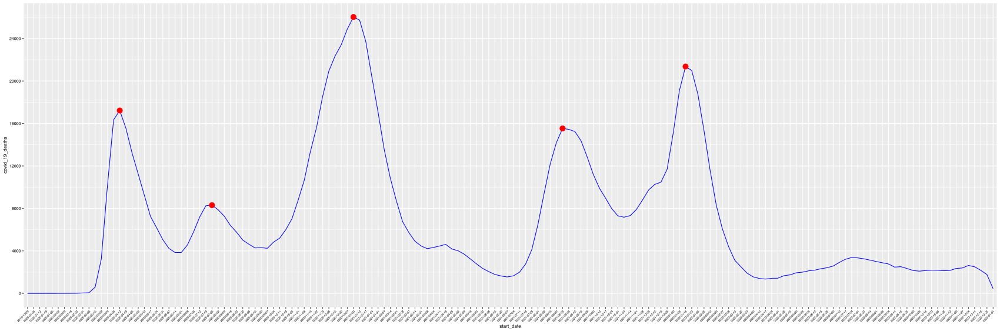

# Analysis US COVID peak period from CDC weekly data

## Goal

According to weekly data between 2020 to 2022, we want to get to know the wave and peak of COVID in these years.

## Download the data
We will continue to use NCHS(National Center for Health Statistics) as our data source.
Visit https://data.cdc.gov/browse?category=NCHS&sortBy=last_modified, and search `Provisional COVID-19 Death Counts by Week`, we will find the data we are intrest.

https://data.cdc.gov/NCHS/Provisional-COVID-19-Death-Counts-by-Week-Ending-D/r8kw-7aab, in this page, we can export data into csv file.

With that, we may get the data source csv, `Provisional_COVID-19_Death_Counts_by_Week_Ending_Date_and_State.csv`.


## Load the data

```
library("dplyr")
library("janitor")
library("tidyr")
library("readr")
df <- readr::read_csv(file.path(getwd(), "Provisional_COVID-19_Death_Counts_by_Week_Ending_Date_and_State.csv"), col_names = TRUE)
df <- clean_names(df)
tmp_start_date <- strptime(df$start_date, "%m/%d/%Y")
df$start_date <- format(tmp_start_date, "%Y-%m-%d")

 > glimpse(df)
 Rows: 10,800
 Columns: 17
 $ data_as_of                             <chr> "01/09/2023", "01/09/2023", "01…
 $ start_date                             <chr> "2019-12-29", "2020-01-05", "20…
 $ end_date                               <chr> "01/04/2020", "01/11/2020", "01…
 $ group                                  <chr> "By Week", "By Week", "By Week"…
 $ year                                   <chr> "2019/2020", "2020", "2020", "2…
 $ month                                  <dbl> NA, NA, NA, NA, NA, NA, NA, NA,…
 $ mmwr_week                              <dbl> 1, 2, 3, 4, 5, 6, 7, 8, 9, 10, …
 $ week_ending_date                       <chr> "01/04/2020", "01/11/2020", "01…
 $ state                                  <chr> "United States", "United States…
 $ covid_19_deaths                        <dbl> 0, 1, 2, 3, 0, 4, 6, 6, 9, 38, …
 $ total_deaths                           <dbl> 60176, 60734, 59362, 59162, 588…
 $ percent_of_expected_deaths             <dbl> 98, 97, 98, 99, 99, 100, 100, 1…
 $ pneumonia_deaths                       <dbl> 4111, 4153, 4066, 3915, 3818, 3…
 $ pneumonia_and_covid_19_deaths          <dbl> 0, 1, 2, 0, 0, 1, 1, 3, 5, 19, …
 $ influenza_deaths                       <dbl> 434, 475, 468, 500, 481, 520, 5…
 $ pneumonia_influenza_or_covid_19_deaths <dbl> 4545, 4628, 4534, 4418, 4299, 4…
 $ footnote                               <chr> NA, NA, NA, NA, NA, NA, NA, NA,…

 !> df
 # A tibble: 10,800 × 17
    data_as_of start_date end_d…¹ group year  month mmwr_…² week_…³ state covid…⁴
    <chr>      <chr>      <chr>   <chr> <chr> <dbl>   <dbl> <chr>   <chr>   <dbl>
  1 01/09/2023 2019-12-29 01/04/… By W… 2019…    NA       1 01/04/… Unit…       0
  2 01/09/2023 2020-01-05 01/11/… By W… 2020     NA       2 01/11/… Unit…       1
  3 01/09/2023 2020-01-12 01/18/… By W… 2020     NA       3 01/18/… Unit…       2
  4 01/09/2023 2020-01-19 01/25/… By W… 2020     NA       4 01/25/… Unit…       3
  5 01/09/2023 2020-01-26 02/01/… By W… 2020     NA       5 02/01/… Unit…       0
  6 01/09/2023 2020-02-02 02/08/… By W… 2020     NA       6 02/08/… Unit…       4
  7 01/09/2023 2020-02-09 02/15/… By W… 2020     NA       7 02/15/… Unit…       6
  8 01/09/2023 2020-02-16 02/22/… By W… 2020     NA       8 02/22/… Unit…       6
  9 01/09/2023 2020-02-23 02/29/… By W… 2020     NA       9 02/29/… Unit…       9
 10 01/09/2023 2020-03-01 03/07/… By W… 2020     NA      10 03/07/… Unit…      38
 # … with 10,790 more rows, 7 more variables: total_deaths <dbl>,
 #   percent_of_expected_deaths <dbl>, pneumonia_deaths <dbl>,
 #   pneumonia_and_covid_19_deaths <dbl>, influenza_deaths <dbl>,
 #   pneumonia_influenza_or_covid_19_deaths <dbl>, footnote <chr>, and
 #   abbreviated variable names ¹ end_date, ² mmwr_week, ³ week_ending_date,
 #   ⁴ covid_19_deaths
 # ℹ Use `print(n = ...)` to see more rows, and `colnames()` to see all variable names
```


## Identify the data we want to focus

As we can see, there are 4 diffrent groups, and it has the `whole United states` and each state's data
```
> unique(df$group)
[1] "By Week"  "By Month" "By Year"  "By Total"
>
```

We only want to get the weekly data, so we may want to `filter` with "group=By Week", and "state=United states"
in the mean time, we may only want to `select` only 2 columns.
 - start_date
 - covid_19_deaths

```
> df1 <- df %>%
    filter(state == "United States" & group == "By Week") %>%
    select(start_date, covid_19_deaths)
> print(df1,n=20)
+ > # A tibble: 158 × 2
   start_date covid_19_deaths
   <chr>                <dbl>
 1 2019-12-29               0
 2 2020-01-05               1
 3 2020-01-12               2
 4 2020-01-19               3
 5 2020-01-26               0
 6 2020-02-02               4
 7 2020-02-09               6
 8 2020-02-16               6
 9 2020-02-23               9
10 2020-03-01              38
11 2020-03-08              60
12 2020-03-15             588
13 2020-03-22            3226
14 2020-03-29           10141
15 2020-04-05           16347
16 2020-04-12           17221
17 2020-04-19           15557
18 2020-04-26           13223
19 2020-05-03           11243
20 2020-05-10            9239
...

```


## Draw the graph to see the wave
```
library("ggplot2")
library("sjPlot")
p = ggplot(df1, aes( x=start_date, y=covid_19_deaths, group=1)) +
    geom_line(color="blue") +
    theme(axis.text.x=element_text(angle=45,hjust=1,size=5))
save_plot("covid_plot_weekly_wave.svg", fig = p, width=60, height=20)
```



## Find the peak by R mark it in the graph

From above graph, we can easily to figure out the waves and peaks, but we also can let R help us to do it, it's pretty useful if we have to deal with many data and many graphs.

To achive it, firstly we can call `findpeaks` from `pracma` library to find the peaks


```
library("pracma")
+ peaks = findpeaks(df1$covid_19_deaths, npeaks=5,  sortstr=TRUE)
> > peaks
      [,1] [,2] [,3] [,4]
[1,] 26027   54   40   66
[2,] 21364  108   98  121
[3,] 17221   16    8   26
[4,] 15536   88   79   98
[5,]  8308   31   26   38
>
```

The 2nd column means the the row index of the peak. in this case, we can tell, the 54th row has the top peak covid death number `26027`.

It's not very obvious which week(start_date) is hitting the peak, so we can do something like this.
```
is_peak <- vector( "logical" , length(df1$covid_19_deaths ))
df1$is_peak = is_peak

for (x in peaks[,2]) {
  df1$is_peak[x] = TRUE
}
```

As you can see, we added a new column `is_peak`, so we can use it to filter out those none peak data, sort the peak data points.
```
!> df2 = df1 %>% filter(is_peak == TRUE)
 + df2[order(-df2$covid_19_deaths),]
 > # A tibble: 5 × 3
   start_date covid_19_deaths is_peak
   <chr>                <dbl> <lgl>
 1 2021-01-03           26027 TRUE
 2 2022-01-16           21364 TRUE
 3 2020-04-12           17221 TRUE
 4 2021-08-29           15536 TRUE
 5 2020-07-26            8308 TRUE
 > >
```


## Hightlight the peak points

```
p = ggplot(df1, aes(x=start_date, y=covid_19_deaths, group=1)) +
    geom_line(color="blue") +
    geom_point(data = . %>% filter(is_peak == TRUE), stat="identity", size = 4, color = "red") +
    scale_y_continuous(breaks=seq(0,30000,4000)) +
    theme(axis.text.x=element_text(angle=45,hjust=1,size=5))

save_plot("covid_plot_weekly_peak.svg", fig = p, width=60, height=20)
```





## Other finding
```
!> > sum(df1$covid_19_deaths)
 [1] 1089714   ===> the total covid_19_deaths death number from 2020 to 2022

!> summary(df1$covid_19_deaths)
    Min. 1st Qu.  Median    Mean 3rd Qu.    Max.
       0    2223    4428    6897    9862   26027
 >
!> df3 <- df %>%
 +     filter(state == "United States" & group == "By Week") %>%
 +     select(start_date, total_deaths)
 + sum(df3$total_deaths)
 + summary(df3$total_deaths)
 + > [1] 10077273  ===> the total death number from 2020 to 2022
 >    Min. 1st Qu.  Median    Mean 3rd Qu.    Max.
    7100   58522   60451   63780   68610   87415
 >
```
