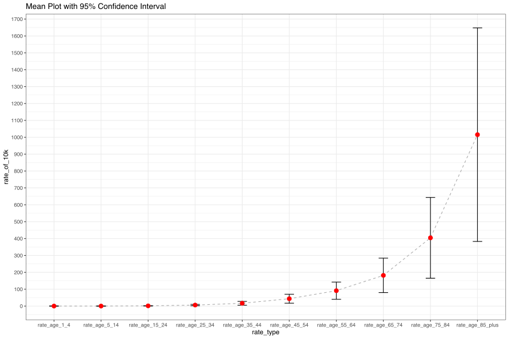
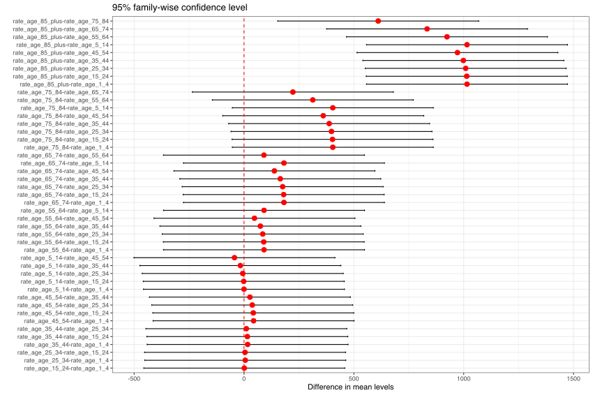

# Analysis US COVID Data to understand age impact

## Goal

We want to analysis the relationship between age and covid death rate in US.
## Download the data

We will use NCHS(National Center for Health Statistics) as our data source.
Visit https://data.cdc.gov/browse?category=NCHS&sortBy=last_modified, and search ```VSRR Quarterly```, we will find the data we are intrest.

https://data.cdc.gov/NCHS/NCHS-VSRR-Quarterly-provisional-estimates-for-sele/489q-934x, in this page, we can export data into csv file.

With that, we may can download data source csv, ```NCHS_-_VSRR_Quarterly_provisional_estimates_for_selected_indicators_of_mortality.csv```

## Load the data

```
library("dplyr")
library("ggplot2")
library("janitor")
library("tidyr")
library("readr")
library("sjPlot")
df <- readr::read_csv(file.path(getwd(), "NCHS_-_VSRR_Quarterly_provisional_estimates_for_selected_indicators_of_mortality.csv"), col_names = TRUE)
df <- clean_names(df)
# To fix the colname format from origin csv file
df <- df %>% rename("rate_age_65_74" = "rate_65_74")
```

## Filter and Select

```
df1 <- df %>%
    filter(time_period == "3-month period" & rate_type == "Crude" & cause_of_death %in% c("COVID-19")) %>%
    select(year_and_quarter, rate_age_1_4, rate_age_5_14,rate_age_15_24, rate_age_25_34,rate_age_35_44, rate_age_45_54,rate_age_55_64,rate_age_65_74,rate_age_75_84,rate_age_85_plus)
  # take a quick look from column's point of view
!> glimpse(df1)
 Rows: 14
 Columns: 11
 $ year_and_quarter <chr> "2019 Q1", "2019 Q2", "2019 Q3", "2019 Q4", "2020 Q1"…
 $ rate_age_1_4     <dbl> NA, NA, NA, NA, NA, 0.2, NA, 0.2, 0.2, 0.2, 0.6, 0.4,…
 $ rate_age_5_14    <dbl> NA, NA, NA, NA, NA, 0.1, 0.2, 0.2, 0.2, 0.1, 0.6, 0.5…
 $ rate_age_15_24   <dbl> NA, NA, NA, NA, 0.1, 1.4, 1.5, 1.6, 1.9, 1.0, 5.9, 4.…
 $ rate_age_25_34   <dbl> NA, NA, NA, NA, 0.8, 6.6, 5.4, 6.7, 8.9, 4.6, 23.8, 1…
 $ rate_age_35_44   <dbl> NA, NA, NA, NA, 2.1, 18.8, 16.1, 20.6, 25.1, 11.9, 65…
 $ rate_age_45_54   <dbl> NA, NA, NA, NA, 4.9, 56.1, 42.8, 64.4, 79.9, 33.9, 14…
 $ rate_age_55_64   <dbl> NA, NA, NA, NA, 9.3, 129.8, 96.0, 162.0, 201.9, 67.4,…
 $ rate_age_65_74   <dbl> NA, NA, NA, NA, 19.0, 293.6, 206.7, 413.6, 464.8, 109…
 $ rate_age_75_84   <dbl> NA, NA, NA, NA, 43.9, 725.6, 465.8, 1112.4, 1110.7, 1…
 $ rate_age_85_plus <dbl> NA, NA, NA, NA, 97.7, 2210.8, 1127.2, 3101.9, 2783.8,…
```


## ```pivot_longer``` to reorg the data for grouping
```
df2 = df1 %>% pivot_longer(names_to = "rate_type", values_to = "rate_of_10k",cols = -c(year_and_quarter))
# convert NA to 0
df2 <- df2 %>%
    mutate_at(c("rate_of_10k"), ~coalesce(.,0))
!> df2
 # A tibble: 140 × 3
    year_and_quarter rate_type        rate_of_10k
    <chr>            <chr>                  <dbl>
  1 2019 Q1          rate_age_1_4               0
  2 2019 Q1          rate_age_5_14              0
  3 2019 Q1          rate_age_15_24             0
  4 2019 Q1          rate_age_25_34             0
  5 2019 Q1          rate_age_35_44             0
  6 2019 Q1          rate_age_45_54             0
  7 2019 Q1          rate_age_55_64             0
  8 2019 Q1          rate_age_65_74             0
  9 2019 Q1          rate_age_75_84             0
 10 2019 Q1          rate_age_85_plus           0	
```

## Draw diagram for each group

```
plotdata <- df2 %>%
    group_by(rate_type) %>%
    summarize(n = n(),
            mean = mean(rate_of_10k),
            sd = sd(rate_of_10k),
            ci = qt(0.975, df = n - 1) * sd / sqrt(n))
p = ggplot(plotdata,
       aes(x = factor(rate_type, level = c('rate_age_1_4','rate_age_5_14','rate_age_15_24','rate_age_25_34','rate_age_35_44','rate_age_45_54','rate_age_55_64','rate_age_65_74','rate_age_75_84','rate_age_85_plus'))
         , y = mean, group = 1)) +
    geom_line(linetype="dashed", color="darkgrey") +
    geom_errorbar(aes(ymin = mean - ci,
                      ymax = mean + ci),
                  width = .2) +
    geom_point(size = 3, color="red") +
    scale_y_continuous(breaks=seq(0,1800,100)) +
    theme_bw() +
    labs(x="rate_type",
         y="rate_of_10k",
         title="Mean Plot with 95% Confidence Interval")
save_plot("covid_plot_age_impact1.svg", fig = p, width=30, height=20)
```



## ANOVA analysis
Analysis of variance (ANOVA) is a collection of statistical models and their associated estimation procedures (such as the "variation" among and between groups) used to analyze the differences among means.
It's very useful in our case, `aov` from R make it very easy to use, see https://www.rdocumentation.org/packages/stats/versions/3.6.2/topics/aov for more detail.


```
fit <- aov(rate_of_10k ~ rate_type, data=df2)
summary(fit)
!> summary(fit)
              Df   Sum Sq Mean Sq F value   Pr(>F)
 rate_type     9 12988087 1443121   10.21 8.49e-12 ***
 Residuals   130 18370513  141312
 ---
 Signif. codes:  0 ‘***’ 0.001 ‘**’ 0.01 ‘*’ 0.05 ‘.’ 0.1 ‘ ’ 1
```

we saw `8.49e-12 ***`, which age has big impact on covid death rate.

## Compare diffrent age ranges
```
pairwise <- TukeyHSD(fit)
pairwise

 + pairwise
 >   Tukey multiple comparisons of means
     95% family-wise confidence level

 Fit: aov(formula = rate_of_10k ~ rate_type, data = df2)

 $rate_type
                                          diff        lwr       upr     p adj
 rate_age_15_24-rate_age_1_4        1.25000000 -456.16974  458.6697 1.0000000
 rate_age_25_34-rate_age_1_4        5.87857143 -451.54117  463.2983 1.0000000
 rate_age_35_44-rate_age_1_4       16.50714286 -440.91259  473.9269 1.0000000
 rate_age_45_54-rate_age_1_4       43.45714286 -413.96259  500.8769 0.9999996
 rate_age_5_14-rate_age_1_4        -0.02857143 -457.44831  457.3912 1.0000000
 ....
```

if `p adj` is close to 1, it means `no big difference` for this pair
if `p adj` is close to 0, it means `big difference` for this pair


## Draw diagram for pairs comparisons
```
plotdata <- as.data.frame(pairwise[[1]])
plotdata$conditions <- row.names(plotdata)
p = ggplot(data=plotdata, aes(x=conditions, y=diff)) +
  geom_errorbar(aes(ymin=lwr, ymax=upr, width=.2)) +
  geom_hline(yintercept=0, color="red", linetype="dashed") +
  geom_point(size=3, color="red") +
  theme_bw() +
  labs(y="Difference in mean levels", x="",
       title="95% family-wise confidence level") +
   coord_flip()
save_plot("covid_plot_age_impact2.svg", fig = p, width=30, height=20)
```




## Conclusion

- Age does have big impact for covid death rate
- 85+ was impacted the most
- For 35- the death rate is very low, and no big difference from age 0-35
